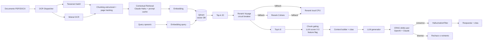

# RAG industrial con doble juez y circuit breaker

> Sistema RAG on-premise para un cliente industrial europeo. En producción,
> uso diario, con métricas medibles.

## Problema

El cliente tiene manuales técnicos de maquinaria industrial (miles de páginas,
mezcla de nativos y escaneos). Los operarios necesitan respuestas rápidas y
correctas — un asistente que **no invente**.

Restricciones:

- On-premise (dato sensible dentro de la red del cliente)
- Multi-idioma
- Debe manejar tablas, diagramas, imágenes de tablets
- Debe rendir cuentas: métricas de calidad publicables y reproducibles
- Requiere trazabilidad: cada respuesta con cita a fuente

## Métricas en producción

- **Faithfulness 0,96 mediana** (0,86 media) y **context precision 0,997**, medidos
  con RAGAS sobre tráfico real y capturados semanalmente como baselines versionados
- **100% de correcciones históricas del supervisor resueltas o mejoradas**
- **0 regresiones** en el set de fallos conocidos
- **Feedback negativo reducido casi a la mitad** vs baseline sin CRAG

## Arquitectura

## Decisiones clave con rationale

### Contextual Retrieval (Anthropic-style)

**Problema**: los chunks pequenios pierden contexto. "Apretar el perno M8 a 22 Nm"
sin decir de que maquina o seccion.

**Fix**: antes de embedear cada chunk, un LLM chico genera 50-100 tokens de
"anclaje situacional" (donde vive el chunk en el documento).

**Costo**: usamos Claude Haiku con **prompt caching** — el documento va en el
bloque cacheado (TTL 5 min), solo cambia el chunk. Re-ingesta de 1.500 chunks
en ~15 min por ~$1. Ahorro reportado: −49% retrievals fallidos solo, −67% con
reranking encima.

**Fallback**: OpenAI gpt-4o-mini (sin cache nativo de 5 min, más lento).

### Reranking con circuit breaker

**Trigger real**: outage de Cohere el 2026-05-02. Cada query pagaba 5s de timeout
retry antes de fallar al fallback.

**Fix**: circuit breaker por proveedor. `_FAIL_THRESHOLD=3` fallos en `_FAIL_WINDOW_S=30s`
abren el breaker. `_RECOVERY_WINDOW_S=60s` antes del probe. Threading:
state a nivel modulo compartido entre asyncio tasks, un lock. No requiere
estado cross-process — cada worker cura solo.

**Resultado**: latencia en modo degradado bajó de 5s/query a ~0ms (skip explícito
hasta el probe).

**Migración**: Cohere v3.5 multilingual → Voyage rerank-2.5-lite (+6-8% en 31 idiomas
según benchmarks internos, 200M tokens free tier). El fallback local (cross-encoder
en CPU) siempre disponible como último recurso.

### CRAG con doble juez OpenAI + Claude

**Por que dos jueces**: uno solo tiene su propio bias. Dos jueces de familias distintas
bajan el sesgo. Cuando disienten, tenemos senal de "duda" — mejor rechazar/reintentar
que emitir con baja confianza.

**Costo**: pequenio. El juez ve solo el contexto ya filtrado + la respuesta candidata,
no el corpus.

### Chunk-level gating post-rerank (feature-flagged, eval-gated)

**Problema**: el reranker scorea similitud pero no razona si el chunk **responde**
la pregunta. Chunks de otro documento con vocabulario parecido se cuelan.

**Fix**: scorer LLM 0-3 por chunk después del reranker. UNA llamada batched (no
1-por-chunk), un scorer (no scorer + critic). Default `min_score=1`: solo descarta el 0.

**Ojo**: la ganancia del paper ChunkRAG (NAACL SRW 2025) es grande en fact-lookup
corto pero casi nula en respuestas largas. Nadie valido sobre cross-document leakage
en manuales industriales. Por eso va detras de flag y se A/B testea contra gold
antes de activar. **Medir antes de shippear**.

### 4 pipelines CI/CD separados

- **tests**: unit + integración
- **security**: scans de dependencias, CVE, secretos
- **regression**: set de fallos conocidos del supervisor, cualquier regresion bloquea merge
- **eval**: Ragas (faithfulness, answer relevancy, context precision/recall) + gold set

## Anti-patterns que evitamos

- ❌ **Hybrid retrieval sin medir**: lo probamos, bajó la calidad −15,4% en nuestro corpus. Fuera.
- ❌ **Un solo juez**: bias del proveedor no detectable
- ❌ **Reranker único sin fallback**: la outage de Cohere lo demostro
- ❌ **Chunk fancy sin baseline**: agrego complejidad, gano marginal

## Stack

**Backend**: FastAPI · Celery + Redis · Pydantic v2 · structlog
**Vector DB**: Qdrant (on-premise, filtrable por metadata)
**Modelos**: OpenAI GPT (juez 1, generacion) · Claude Haiku (juez 2 + contextual retrieval con cache) · Mistral OCR · Voyage rerank-2.5-lite · Cohere v3.5 (legacy) · faster-whisper (audio) · fastText (language detection)
**Frontend**: Vue 3 PWA para tablets industriales
**Operacion**: Docker + docker-compose · nginx · Sentry · Prometheus · OpenTelemetry
**Multilingual**: fastText lid.218 + lingua-language-detector (secondary)

## Código de referencia sintético

Los patrones están reproducidos en [`rag-crag-reference`](https://github.com/jpfiguer/rag-crag-reference):

- `circuit_breaker.py` — el patron completo con tests
- `crag_dual_judge.py` — orquestacion de los dos jueces con consenso
- `contextual_retrieval.py` — llamada con prompt caching y fallback

## Lecciones que me llevo

- **Falla silenciosa = bug más caro**: subimos el timeout de Mistral OCR de 180s a
  300s porque manuales de 140+ páginas escaneadas quedaban sin indexar en silencio.
- **Bug real por Unicode**: "¿Qué hora es?" contestaba con info del panel Ferroli
  porque los patterns no normalizaban NFD. "que hora es" (sin acento) funcionaba.
  Fix: normalizar antes del regex.
- **A veces el fix es no llamar al LLM**: llama3:8b no respeta la instruccion de
  brevedad en saludos. Detector de farewell + respuesta fija = mejor UX y $0.
