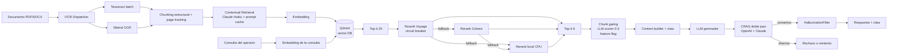

# RAG industrial con doble juez y circuit breaker

> Sistema RAG sobre manuales técnicos para un cliente industrial europeo.
> Corre en la infraestructura del cliente, con GPU, y está en producción con
> uso diario.

## Contexto

El cliente tiene manuales técnicos de maquinaria industrial: miles de páginas,
entre documentos nativos y escaneados. Los operarios necesitan respuestas
rápidas y correctas de un asistente que **no invente**.

Restricciones:

- Despliegue en la infraestructura del cliente, con GPU. El OCR, la
  contextualización de chunks, el reranking y los jueces usan APIs externas.
- Varios idiomas.
- Tiene que manejar tablas, diagramas e imágenes tomadas con las tablets.
- Tiene que rendir cuentas con métricas de calidad publicables y
  reproducibles.
- Trazabilidad: cada respuesta cita su fuente.

## Métricas de calidad

Medidas con RAGAS sobre tráfico real de producción y capturadas semanalmente
como baselines versionados:

- **Faithfulness**: 0,96 de mediana y 0,855 de media.
- **Context precision**: 0,997.

Las correcciones históricas del supervisor del cliente forman el set de
regresión que corre en CI.

## Arquitectura

```mermaid
flowchart LR
  A[Documento PDF/DOCX] --> B[OCR Dispatcher]
  B --> B1[Tesseract batch]
  B --> B2[Mistral OCR]
  B1 & B2 --> C[Chunking estructural + page tracking]
  C --> D[Contextual Retrieval<br/>Claude Haiku + prompt cache]
  D --> E[Embedding]
  E --> F[(Qdrant<br/>vector DB)]

  G[Consulta del operario] --> H[Embedding de la consulta]
  H --> F
  F --> I[Top-k 20]
  I --> J[Rerank Voyage<br/>circuit breaker]
  J -->|fallback| J2[Rerank Cohere]
  J & J2 -->|fallback| J3[Rerank local CPU]
  J & J2 & J3 --> K[Top-k 8]
  K --> L[Chunk gating<br/>LLM scorer 0-3<br/>feature flag]
  L --> M[Context builder + citas]
  M --> N[LLM generador]
  N --> O[CRAG doble juez<br/>OpenAI + Claude]
  O -->|consenso| P[HallucinationFilter]
  O -->|disenso| Q[Rechazo o reintento]
  P --> R[Respuesta + citas]
```

## Decisiones de diseño

### Contextual retrieval (técnica de Anthropic)

**Problema**: los chunks pequeños pierden contexto. "Apretar el perno M8 a 22 Nm"
no dice de qué máquina ni de qué sección se trata.

**Solución**: antes de generar el embedding de cada chunk, un modelo pequeño
escribe entre 50 y 100 tokens de "anclaje situacional", que indican dónde está
el chunk dentro del documento.

**Costo**: usamos Claude Haiku con **prompt caching**. El documento va en el
bloque cacheado (TTL de 5 minutos) y en cada llamada solo cambia el chunk, así
que el documento se escribe una vez en la caché y las llamadas siguientes lo
leen a una fracción del precio.

**Referencia**: los resultados que publicó Anthropic combinan embeddings
contextuales, BM25 contextual y reranking. Este sistema usa embeddings
contextuales y reranking, sin BM25, porque en este corpus la búsqueda híbrida
empeoró la calidad (ver más abajo).

**Fallback**: OpenAI gpt-4o-mini. OpenAI también cachea prompts, de forma
automática y sin que haya que marcar bloques.

### Reranking con circuit breaker

**Qué lo gatilló**: una caída de Cohere el 2 de mayo de 2026. Cada consulta
esperaba un timeout de 5 segundos, con reintento, antes de pasar al fallback.

**Solución**: un circuit breaker por proveedor. `_FAIL_THRESHOLD=3` fallos
dentro de `_FAIL_WINDOW_S=30` segundos abren el breaker, y después de
`_RECOVERY_WINDOW_S=60` segundos se deja pasar una consulta de prueba. El
estado vive a nivel de módulo, compartido entre las tareas de asyncio y
protegido por un lock. No hace falta estado compartido entre procesos, porque
cada worker se recupera por su cuenta.

**Resultado**: mientras el breaker está abierto, las consultas pasan directo al
siguiente proveedor, sin esperar el timeout, hasta que la consulta de prueba
confirma que el proveedor volvió.

**Migración**: el reranker principal pasó de Cohere v3.5 multilingual a Voyage
rerank-2.5-lite, por calidad multilingüe y por costo. Cohere quedó como
fallback, y un cross-encoder local en CPU está siempre disponible como último
recurso.

### CRAG con dos jueces, OpenAI y Claude

**Por qué dos jueces**: un solo juez arrastra el sesgo de su proveedor. Dos
jueces de familias distintas lo reducen, y cuando no coinciden dan una señal de
duda. En ese caso es preferible rechazar o reintentar que emitir una respuesta
con baja confianza.

**Costo**: bajo, porque los jueces ven solo el contexto ya filtrado y la
respuesta candidata, sin el corpus.

### Filtro de chunks después del reranking

**Problema**: el reranker puntúa similitud, pero no evalúa si el chunk
**responde** la pregunta. Se cuelan chunks de otros documentos con vocabulario
parecido.

**Solución**: después del reranker, un LLM asigna a cada chunk un puntaje de 0
a 3. Es una sola llamada con todos los chunks, en vez de una por chunk, y un
solo evaluador, sin un crítico adicional. Con el valor por defecto,
`min_score=1`, solo se descartan los chunks con puntaje 0.

**Ojo**: la mejora que reporta el paper ChunkRAG (NAACL SRW 2025) es grande en
preguntas factuales cortas y casi nula en respuestas largas, y no encontré
evaluaciones sobre chunks que se cuelan desde otros documentos en manuales
industriales. Por eso queda detrás de un feature flag y se compara contra el
gold set antes de activarlo.

### Cinco workflows de CI

- **Tests**: pruebas unitarias y de integración.
- **Evaluación**: RAGAS (faithfulness, answer relevancy, context precision y
  context recall) y un gold set.
- **Regresión**: el set de fallos conocidos que registró el supervisor.
  Cualquier regresión bloquea el merge.
- **Seguridad**: escaneo de dependencias, CVE y secretos.
- **Captura de baseline**: guarda las métricas como baselines versionados.

## Lo que descartamos

- **Búsqueda híbrida sin medir**: la probamos y en este corpus empeoró la
  calidad, así que quedó fuera.
- **Un solo juez**: el sesgo de su proveedor pasa inadvertido.
- **Un reranker sin fallback**: la caída de Cohere mostró lo que cuesta.
- **Chunking sofisticado sin baseline**: sumó complejidad para una ganancia
  marginal.

## Stack

- **Backend**: FastAPI · Celery + Redis · Pydantic v2 · structlog
- **Base vectorial**: Qdrant autoalojado, con filtros por metadata
- **Modelos**: OpenAI GPT (juez) · Claude Haiku (juez y contextual retrieval
  con caché) · Mistral OCR · Voyage rerank-2.5-lite · Cohere v3.5 (fallback) ·
  faster-whisper (audio)
- **Detección de idioma**: fastText lid.218, con lingua-language-detector como
  respaldo
- **Frontend**: PWA en Vue 3 para tablets industriales
- **Operación**: Docker y docker-compose · nginx · Sentry · Prometheus ·
  OpenTelemetry

## Lecciones

- **La falla silenciosa es la más cara**: subimos el timeout de Mistral OCR de
  180 a 300 segundos porque los manuales escaneados de más de 140 páginas
  quedaban sin indexar y nada lo advertía.
- **Un bug de Unicode**: "¿Qué hora es?" se respondía con información de un
  panel de control porque los patrones no normalizaban a NFD, mientras que
  "que hora es", sin tilde, funcionaba. La corrección fue normalizar el texto
  antes de aplicar el regex.
- **A veces la solución es no llamar al LLM**: el modelo no respetaba la
  instrucción de responder breve a saludos y despedidas. Ahora un detector
  reconoce esos mensajes y devuelve una respuesta fija.
