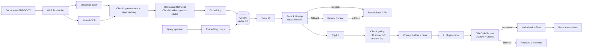

# RAG industrial con doble juez y circuit breaker

> Sistema RAG on-premise para un cliente industrial europeo. En producción,
> uso diario, con métricas medibles.

## Problema

El cliente tiene manuales técnicos de maquinaria industrial (miles de páginas,
mezcla de nativos y escaneos). Los operarios necesitan respuestas rápidas y
correctas — un asistente que **no invente**.

Restricciones:

- On-premise (dato sensible dentro de la red del cliente)
- Multi-idioma
- Debe manejar tablas, diagramas, imágenes de tablets
- Debe rendir cuentas: métricas de calidad publicables y reproducibles
- Requiere trazabilidad: cada respuesta con cita a fuente

## Métricas en producción

Medidas con RAGAS sobre tráfico real de producción y capturadas semanalmente
como baselines versionados:

- **Faithfulness**: 0,96 de mediana y 0,855 de media.
- **Context precision**: 0,997.

Las correcciones históricas del supervisor del cliente forman el set de
regresión que corre en CI.

## Arquitectura

```mermaid
flowchart LR
  A[Documento PDF/DOCX] --> B[OCR Dispatcher]
  B --> B1[Tesseract batch]
  B --> B2[Mistral OCR]
  B1 & B2 --> C[Chunking estructural + page tracking]
  C --> D[Contextual Retrieval<br/>Claude Haiku + prompt cache]
  D --> E[Embedding]
  E --> F[(Qdrant<br/>vector DB)]

  G[Query operario] --> H[Embedding query]
  H --> F
  F --> I[Top-k 20]
  I --> J[Rerank Voyage<br/>circuit breaker]
  J -->|fallback| J2[Rerank Cohere]
  J & J2 -->|fallback| J3[Rerank local CPU]
  J --> K[Top-k 8]
  K --> L[Chunk gating<br/>LLM scorer 0-3<br/>feature flag]
  L --> M[Context builder + citas]
  M --> N[LLM generador]
  N --> O[CRAG doble juez<br/>OpenAI + Claude]
  O -->|consenso| P[HallucinationFilter]
  O -->|disenso| Q[Rechazo o reintento]
  P --> R[Respuesta + citas]
```

## Decisiones clave con rationale

### Contextual Retrieval (Anthropic-style)

**Problema**: los chunks pequenios pierden contexto. "Apretar el perno M8 a 22 Nm"
sin decir de que maquina o seccion.

**Fix**: antes de embedear cada chunk, un LLM chico genera 50-100 tokens de
"anclaje situacional" (donde vive el chunk en el documento).

**Costo**: usamos Claude Haiku con **prompt caching**. El documento va en el
bloque cacheado (TTL de 5 minutos) y en cada llamada solo cambia el chunk, así
que el documento se escribe una vez en la caché y las llamadas siguientes lo
leen a una fracción del precio.

**Referencia**: los resultados que publicó Anthropic combinan embeddings
contextuales, BM25 contextual y reranking. Este sistema usa embeddings
contextuales y reranking, sin BM25, porque en este corpus la búsqueda híbrida
empeoró la calidad (ver más abajo).

**Fallback**: OpenAI gpt-4o-mini (sin cache nativo de 5 min, más lento).

### Reranking con circuit breaker

**Trigger real**: outage de Cohere el 2026-05-02. Cada query pagaba 5s de timeout
retry antes de fallar al fallback.

**Fix**: circuit breaker por proveedor. `_FAIL_THRESHOLD=3` fallos en `_FAIL_WINDOW_S=30s`
abren el breaker. `_RECOVERY_WINDOW_S=60s` antes del probe. Threading:
state a nivel modulo compartido entre asyncio tasks, un lock. No requiere
estado cross-process — cada worker cura solo.

**Resultado**: mientras el breaker está abierto, las consultas pasan directo al
siguiente proveedor, sin esperar el timeout, hasta que la consulta de prueba
confirma que el proveedor volvió.

**Migración**: el reranker principal pasó de Cohere v3.5 multilingual a Voyage
rerank-2.5-lite, por calidad multilingüe y por costo. Cohere quedó como
fallback, y un cross-encoder local en CPU está siempre disponible como último
recurso.

### CRAG con doble juez OpenAI + Claude

**Por que dos jueces**: uno solo tiene su propio bias. Dos jueces de familias distintas
bajan el sesgo. Cuando disienten, tenemos senal de "duda" — mejor rechazar/reintentar
que emitir con baja confianza.

**Costo**: pequenio. El juez ve solo el contexto ya filtrado + la respuesta candidata,
no el corpus.

### Chunk-level gating post-rerank (feature-flagged, eval-gated)

**Problema**: el reranker scorea similitud pero no razona si el chunk **responde**
la pregunta. Chunks de otro documento con vocabulario parecido se cuelan.

**Fix**: scorer LLM 0-3 por chunk después del reranker. UNA llamada batched (no
1-por-chunk), un scorer (no scorer + critic). Default `min_score=1`: solo descarta el 0.

**Ojo**: la ganancia del paper ChunkRAG (NAACL SRW 2025) es grande en fact-lookup
corto pero casi nula en respuestas largas. Nadie valido sobre cross-document leakage
en manuales industriales. Por eso va detras de flag y se A/B testea contra gold
antes de activar. **Medir antes de shippear**.

### Cinco workflows de CI

- **Tests**: pruebas unitarias y de integración.
- **Evaluación**: RAGAS (faithfulness, answer relevancy, context precision y
  context recall) y un gold set.
- **Regresión**: el set de fallos conocidos que registró el supervisor.
  Cualquier regresión bloquea el merge.
- **Seguridad**: escaneo de dependencias, CVE y secretos.
- **Captura de baseline**: guarda las métricas como baselines versionados.

## Anti-patterns que evitamos

- ❌ **Búsqueda híbrida sin medir**: la probamos y en este corpus empeoró la
  calidad, así que quedó fuera.
- ❌ **Un solo juez**: bias del proveedor no detectable
- ❌ **Reranker único sin fallback**: la outage de Cohere lo demostro
- ❌ **Chunk fancy sin baseline**: agrego complejidad, gano marginal

## Stack

**Backend**: FastAPI · Celery + Redis · Pydantic v2 · structlog
**Vector DB**: Qdrant (on-premise, filtrable por metadata)
**Modelos**: OpenAI GPT (juez 1, generacion) · Claude Haiku (juez 2 + contextual retrieval con cache) · Mistral OCR · Voyage rerank-2.5-lite · Cohere v3.5 (legacy) · faster-whisper (audio) · fastText (language detection)
**Frontend**: Vue 3 PWA para tablets industriales
**Operacion**: Docker + docker-compose · nginx · Sentry · Prometheus · OpenTelemetry
**Multilingual**: fastText lid.218 + lingua-language-detector (secondary)

## Lecciones que me llevo

- **Falla silenciosa = bug más caro**: subimos el timeout de Mistral OCR de 180s a
  300s porque manuales de 140+ páginas escaneadas quedaban sin indexar en silencio.
- **Bug real por Unicode**: "¿Qué hora es?" contestaba con info de un panel de control
  porque los patterns no normalizaban NFD. "que hora es" (sin acento) funcionaba.
  Fix: normalizar antes del regex.
- **A veces el fix es no llamar al LLM**: llama3:8b no respeta la instruccion de
  brevedad en saludos. Detector de farewell + respuesta fija = mejor UX y $0.
