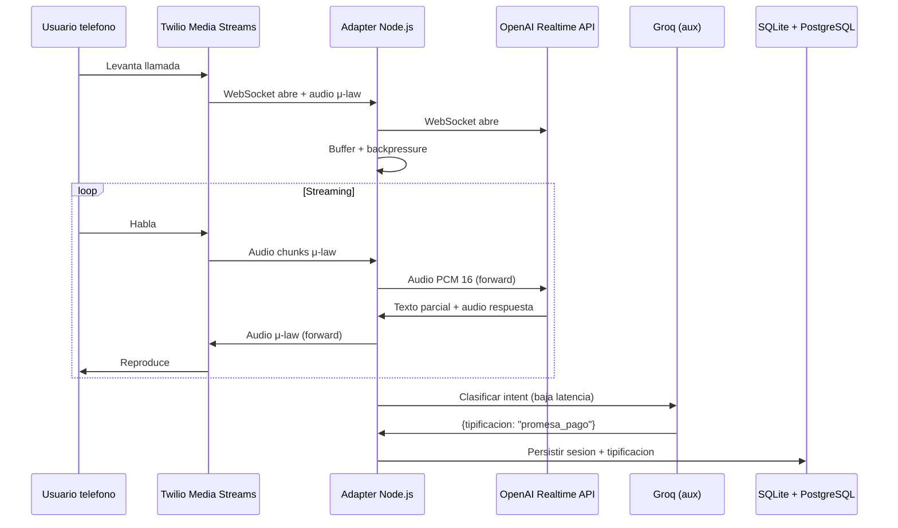

# Agente de voz en tiempo real con streaming bidireccional

> Call center IA con conversacion natural en tiempo real. Streaming bidireccional
> Twilio Media Streams ↔ OpenAI Realtime API sobre WebSockets.

## Problema

Cliente necesitaba automatizar llamadas de cobranza con voz natural — no IVR
(menus tocando 1-2-3). Requisitos:

- Latencia baja (usuario no debe percibir gap)
- Interrupciones naturales (el humano puede hablar por encima del bot)
- Detección de tipificacion (promesa de pago, no puedo hoy, incorrecto, etc.)
- Trazabilidad y grabacion

## Arquitectura

## Decisiones clave

### Adapter Node.js/Express con WebSockets

Un servicio middleman entre Twilio (μ-law audio) y OpenAI (PCM 16). Convierte
formato en ambos sentidos. Buffers pequenios para no acumular latencia.

### Back-pressure

Sin control: si OpenAI genera más rápido que Twilio consume, se acumula el buffer
y la voz se corta o retrasa. Con control: batches de audio hacia OpenAI, chunks
regulados hacia Twilio.

### Groq como auxiliar de baja latencia

OpenAI Realtime hace la conversacion. Groq (mucho más rápido) clasifica tipificacion
al final de cada turno con un LLM chico. No en el critical path del audio.

### Reconexión y timeouts

- Heartbeat cada 20s en ambos WebSockets
- Reintento con backoff exponencial en WebSocket drops
- Timeout global de 4 min por llamada
- Persistencia de sesión en SQLite local (rescatable si el proceso muere)

### Métricas

- Latencia round-trip (usuario → bot audible)
- Drops de audio (chunks perdidos)
- Tasa de tipificacion correcta (validado contra sample humano)
- Tasa de promesa de pago vs operador humano

## Stack

- Node.js + Express
- WebSockets: Twilio Media Streams + OpenAI Realtime API
- Groq (llama-3.3) para clasificacion auxiliar
- SendGrid para correos derivados
- SQLite para sesión, PostgreSQL para agregados
- Twilio SDK, better-sqlite3

## Anti-patterns que evitamos

- ❌ **Sintesis TTS separada + LLM texto**: latencia demasiado alta para conversacion natural
- ❌ **Pipeline audio → transcripcion → LLM → TTS**: 3 hops = mucho lag
- ❌ **Grabar todo primero, procesar después**: pierde interactividad

## Lecciones

- **Los WebSockets fallan más de lo que uno cree** — reconexión robusta es 30% del código
- **Buffer mal calibrado = voz cortada**: mejor un chunk más chico y más frecuente
- **La tipificacion post-turno es más barata que in-line**: no bloquea audio y usa modelo chico
