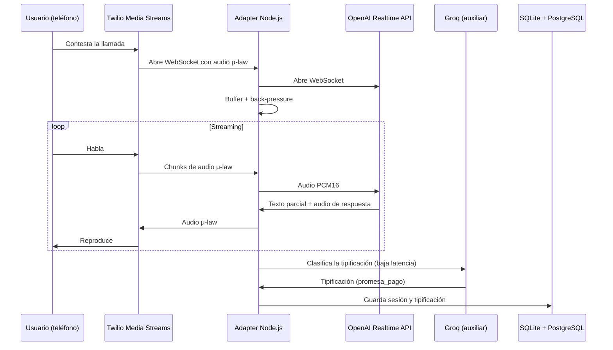

# Agente de voz en tiempo real con streaming bidireccional

> Call center de IA con conversación natural en tiempo real, sobre streaming
> bidireccional por WebSockets entre Twilio Media Streams y la Realtime API de
> OpenAI.

## Qué se necesitaba

El cliente quería automatizar llamadas de cobranza con voz natural, en lugar de
un IVR con menús por teclado. Requisitos:

- Latencia baja, sin pausas que la persona note.
- Interrupciones naturales: la persona puede hablar encima del bot.
- Tipificación de cada llamada ("promesa de pago", "no puedo hoy",
  "incorrecto", etc.).
- Trazabilidad y grabación.

## Flujo de una llamada

```mermaid
sequenceDiagram
  participant U as Usuario (teléfono)
  participant T as Twilio Media Streams
  participant A as Adapter Node.js
  participant O as OpenAI Realtime API
  participant G as Groq (auxiliar)
  participant S as SQLite + PostgreSQL

  U->>T: Contesta la llamada
  T->>A: Abre WebSocket con audio μ-law
  A->>O: Abre WebSocket
  A->>A: Buffer + back-pressure

  loop Streaming
    U->>T: Habla
    T->>A: Chunks de audio μ-law
    A->>O: Audio PCM16
    O->>A: Texto parcial + audio de respuesta
    A->>T: Audio μ-law
    T->>U: Reproduce
  end

  A->>G: Clasifica la tipificación (baja latencia)
  G->>A: Tipificación (promesa_pago)
  A->>S: Guarda sesión y tipificación
```

## Decisiones técnicas

### Adapter Node.js/Express con WebSockets

Un servicio intermedio entre Twilio (audio μ-law) y OpenAI (PCM16) que
convierte el formato en ambos sentidos, con buffers pequeños para no acumular
latencia.

### Back-pressure

Si OpenAI genera audio más rápido de lo que Twilio lo consume, el buffer crece
y la voz se corta o se atrasa. Para controlarlo, el audio hacia OpenAI se envía
en lotes y el que va hacia Twilio sale en chunks a un ritmo regulado.

### Groq como auxiliar de baja latencia

La Realtime API de OpenAI lleva la conversación. Al final de cada turno, Groq
clasifica la tipificación con un LLM pequeño y rápido, fuera del camino crítico
del audio.

### Reconexión y timeouts

- Heartbeat cada 20 segundos en los dos WebSockets.
- Reintentos con backoff exponencial cuando se cae un WebSocket.
- Timeout global de 4 minutos por llamada.
- La sesión se guarda en SQLite local y se puede recuperar si el proceso muere.

### Qué se mide

- Latencia de ida y vuelta, desde que la persona habla hasta que se escucha al
  bot.
- Cortes de audio (chunks perdidos).
- Tasa de tipificación correcta, validada contra una muestra revisada por
  personas.
- Tasa de promesas de pago comparada con la de operadores humanos.

## Stack

- Node.js + Express
- WebSockets: Twilio Media Streams y OpenAI Realtime API
- Groq (llama-3.3) para la clasificación auxiliar
- SendGrid para correos derivados
- SQLite para la sesión y PostgreSQL para agregados
- Twilio SDK, better-sqlite3

## Alternativas descartadas

- **Síntesis de voz separada, con un LLM de texto**: la latencia es demasiado
  alta para una conversación telefónica natural.
- **Encadenar transcripción, LLM y síntesis de voz**: en una llamada con
  interrupciones, tres saltos suman demasiado retraso.
- **Grabar todo primero y procesar después**: se pierde la interactividad.

## Aprendizajes

- **Los WebSockets fallan más de lo que uno cree**, y la reconexión robusta se
  lleva una parte importante del código.
- **Un buffer mal calibrado corta la voz**: conviene enviar chunks más chicos y
  más frecuentes.
- **Tipificar al final del turno es más barato que hacerlo en línea**: no
  bloquea el audio y usa un modelo pequeño.
