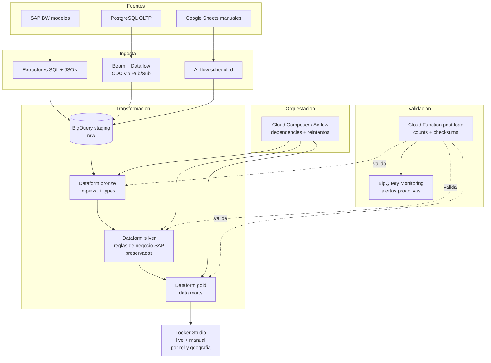

# Migracion SAP BW → BigQuery con Dataform

> 8 modelos de datos criticos migrados. Reglas de negocio SAP preservadas.
> Queries optimizadas: −25% tiempo, −50% costos en promedio.

## Problema

Cliente con 8 modelos criticos en SAP BW: caros, lentos para analisis y bloqueando
la modernizacion del stack analitico. Consumidores downstream (dashboards, jobs
programados, reportes ad-hoc) dependen de estos modelos.

Restricciones:

- **Cero regresiones** para consumidores downstream
- Preservar jerarquias de dimensiones y reglas de negocio SAP intactas
- Migrar en cutover coordinado (no re-work masivo en cascada)
- Habilitar analisis a escala que SAP BW no permitia

## Arquitectura

## Decisiones clave

### Dataform para modelado (no dbt)

- Nativo en BigQuery, sin cluster separado, factura por query no por container
- SQLX preserva SQL puro con jinja-like para modularidad y tests
- Versionado en Git, code review por PR
- Assertions built-in para reglas de negocio (row_conditions, uniqueKey, etc.)

### Preservacion de jerarquias SAP

Los modelos SAP BW tienen jerarquias multi-nivel (empresa → division → linea).
Los reimplemente como tablas de dimensiones con `hierarchy_level`, `parent_id`,
`path_root_to_leaf`. Los reportes downstream migran sin cambiar joins.

### Reglas de negocio en silver, no en gold

Silver = reglas de negocio SAP aplicadas (deduplicacion por natural key,
resolucion de conflictos, enrichment). Gold = cortes agregados listos para
consumo (marts). Silver es la fuente de verdad; gold es una vista optimizada.

### Validacion post-load con Cloud Function + BigQuery Monitoring

Cada bulk insert dispara una Cloud Function que:

- Cuenta filas nuevas vs esperadas (dentro de un rango tolerable)
- Verifica checksum de columnas criticas
- Compara agregados vs fuente (SAP durante migracion, PostgreSQL en steady state)
- Si algo falla → alerta a Slack + rollback opcional

**Resultado**: 100% de precision en cargas medido. Equipo analytics dejo de hacer
reconciliaciones manuales.

### Optimizacion de queries (−25% tiempo, −50% costos)

Tecnicas aplicadas por prioridad:

1. **Particionamiento por fecha** (evento o carga segun caso)
2. **Clustering por columnas filtradas frecuentemente** (empresa, division)
3. **Materializacion selectiva**: tablas materializadas para agregados usados >10x/dia; vistas normales para el resto
4. **Slot reservations donde el patron es predecible**; pago por query donde no
5. **Eliminacion de `SELECT *`** y casts costosos
6. **Tablas externas** para sources que no se necesitan replicar en BQ

Medicion: benchmark del top-20 queries antes/despues sobre 30 dias. Promedio
ponderado por volumen.

### Cutover coordinado

- Doble escritura durante 4 semanas (SAP y BigQuery en paralelo)
- Consumidores migran uno a uno con feature flag
- Semana 5: SAP en read-only, BigQuery unica fuente
- Semana 6+: SAP apagado

## Stack

- BigQuery + Dataform + Cloud Composer / Airflow
- Apache Beam + Dataflow para CDC de PostgreSQL
- Pub/Sub como canal de eventos
- Cloud Functions para validacion post-load
- BigQuery Monitoring para alertas
- Looker Studio para consumo final
- Terraform para infra reproducible
- structlog para logging estructurado

## Anti-patterns evitados

- ❌ **Migrar todo de una vez sin cutover coordinado**: garantia de outage
- ❌ **Reescribir reglas de negocio "mejor"**: multiplicas el trabajo de validacion
- ❌ **Optimizar queries sin medir baseline**: no sabes si mejoraste
- ❌ **Materializar todo** — se paga en storage y refresh

## Codigo de referencia sintetico

Ver [`gcp-etl-pipeline`](https://github.com/jpfiguer/gcp-etl-pipeline):

- Pipeline Beam batch + streaming
- Dataform con estructura bronze/silver/gold
- Cloud Function de validacion
- Terraform del stack completo

## Lecciones

- **Baseline antes de optimizar**: sin numero de arranque, no se sabe si mejoro
- **Doble escritura > cutover big-bang**: reduce riesgo mucho
- **Dataform assertions atrapan cambios silenciosos**: schema drift del origen SAP
