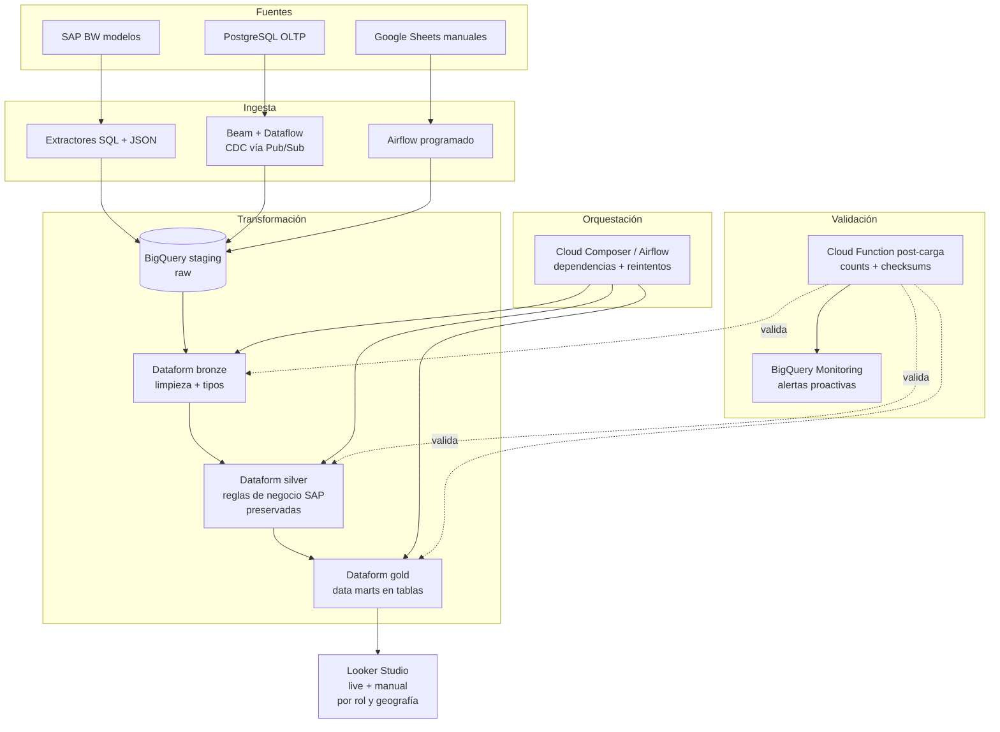

# Migración de SAP BW a BigQuery con Dataform

> Ocho modelos de datos críticos migrados, con las reglas de negocio de SAP
> preservadas. Consultas optimizadas: −25% de tiempo de procesamiento y −50%
> de costo.

## Punto de partida

El cliente tenía ocho modelos críticos en SAP BW, caros y lentos para análisis,
que frenaban la modernización del stack analítico. De ellos dependían
consumidores downstream: dashboards, jobs programados y reportes ad hoc.

Restricciones:

- Ningún consumidor downstream podía romperse.
- Las jerarquías de dimensiones y las reglas de negocio de SAP tenían que
  quedar intactas.
- La migración tenía que ser coordinada, sin obligar a rehacer en cascada el
  trabajo de los consumidores.
- Habilitar análisis a una escala que SAP BW no permitía.

## Arquitectura

```mermaid
flowchart TB
  subgraph Fuentes
    A[SAP BW modelos]
    B[PostgreSQL OLTP]
    C[Google Sheets manuales]
  end

  subgraph Ingesta
    A --> D[Extractores SQL + JSON]
    B --> E[Beam + Dataflow<br/>CDC vía Pub/Sub]
    C --> F[Airflow programado]
  end

  D & E & F --> G[(BigQuery staging<br/>raw)]

  subgraph Transformacion [Transformación]
    G --> H[Dataform bronze<br/>limpieza + tipos]
    H --> I[Dataform silver<br/>reglas de negocio SAP<br/>preservadas]
    I --> J[Dataform gold<br/>data marts en tablas]
  end

  subgraph Orquestacion [Orquestación]
    K[Cloud Composer / Airflow<br/>dependencias + reintentos]
  end

  K --> H
  K --> I
  K --> J

  subgraph Validacion [Validación]
    L[Cloud Function post-carga<br/>counts + checksums]
    L --> M[BigQuery Monitoring<br/>alertas proactivas]
  end

  J --> N[Looker Studio<br/>live + manual<br/>por rol y geografía]

  L -.valida.-> H & I & J
```

## Cómo se resolvió

### Dataform en vez de dbt

- Es nativo de BigQuery: no requiere un cluster aparte y el costo es el de las
  consultas que ejecuta.
- SQLX mantiene el SQL tal cual y usa plantillas JavaScript para la
  modularidad y los tests.
- Versionado en Git, con revisión de código en cada PR.
- Assertions integradas para las reglas de negocio (`rowConditions`,
  `uniqueKey`, etc.).

### Jerarquías de SAP preservadas

Los modelos de SAP BW tienen jerarquías de varios niveles (empresa, división,
línea). Las reimplementé como tablas de dimensiones con `hierarchy_level`,
`parent_id` y `path_root_to_leaf`, así que los reportes downstream migraron sin
cambiar sus joins.

### Las reglas de negocio viven en silver

Silver aplica las reglas de negocio de SAP: deduplicación por llave natural,
resolución de conflictos y enriquecimiento. Gold contiene los cortes agregados
listos para consumo (marts). Silver es la fuente de verdad; gold es la capa de
consumo y se construye como tablas.

### Validación post-carga con Cloud Function y BigQuery Monitoring

Cada carga masiva dispara una Cloud Function que:

- cuenta las filas nuevas contra las esperadas, dentro de un margen tolerable;
- verifica checksums de las columnas críticas;
- compara agregados con la fuente: SAP durante la migración y PostgreSQL en
  operación normal;
- si algo falla, envía una alerta a Slack y, opcionalmente, revierte la carga.

**Resultado**: el equipo de analytics dejó de hacer reconciliaciones manuales.

### Optimización de consultas (−25% de tiempo, −50% de costo)

Técnicas aplicadas, en orden de prioridad:

1. **Particionamiento por fecha**, de evento o de carga según el caso.
2. **Clustering por las columnas que más se filtran** (empresa, división).
3. **Materialización selectiva**: tablas materializadas para los agregados de
   uso frecuente y vistas normales para el resto.
4. **Reservas de slots donde el patrón de uso es predecible**, y pago por
   consulta donde no lo es.
5. **Eliminación de `SELECT *`** y de casts costosos.
6. **Tablas externas** para fuentes que no hace falta replicar en BigQuery.

## Stack

- BigQuery, Dataform y Cloud Composer / Airflow
- Apache Beam + Dataflow para CDC de PostgreSQL
- Pub/Sub como canal de eventos
- Cloud Functions para la validación post-carga
- BigQuery Monitoring para alertas
- Looker Studio para el consumo final
- Terraform para infraestructura reproducible
- structlog para logging estructurado

## Qué evitamos

- **Migrar todo de una vez**: cualquier error llega a todos los consumidores al
  mismo tiempo.
- **Reescribir las reglas de negocio para "mejorarlas"**: multiplica el trabajo
  de validación.
- **Optimizar consultas sin medir antes**: no hay cómo saber si mejoraron.
- **Materializar todo**: se paga en almacenamiento y en refrescos.

## Código de referencia

El repositorio público [`gcp-etl-pipeline`](https://github.com/jpfiguer/gcp-etl-pipeline)
reproduce parte de estos patrones con código sintético:

- Pipelines de Apache Beam en Dataflow, batch y streaming, con Pub/Sub
- Dataform con capas bronze, silver y gold
- Terraform para Pub/Sub, BigQuery y las cuentas de servicio

## Lecciones

- **Medir la línea base antes de optimizar**: sin un número de partida no hay
  cómo saber si algo mejoró.
- **Las assertions de Dataform detectan cambios silenciosos**, como el schema
  drift en el origen SAP.
