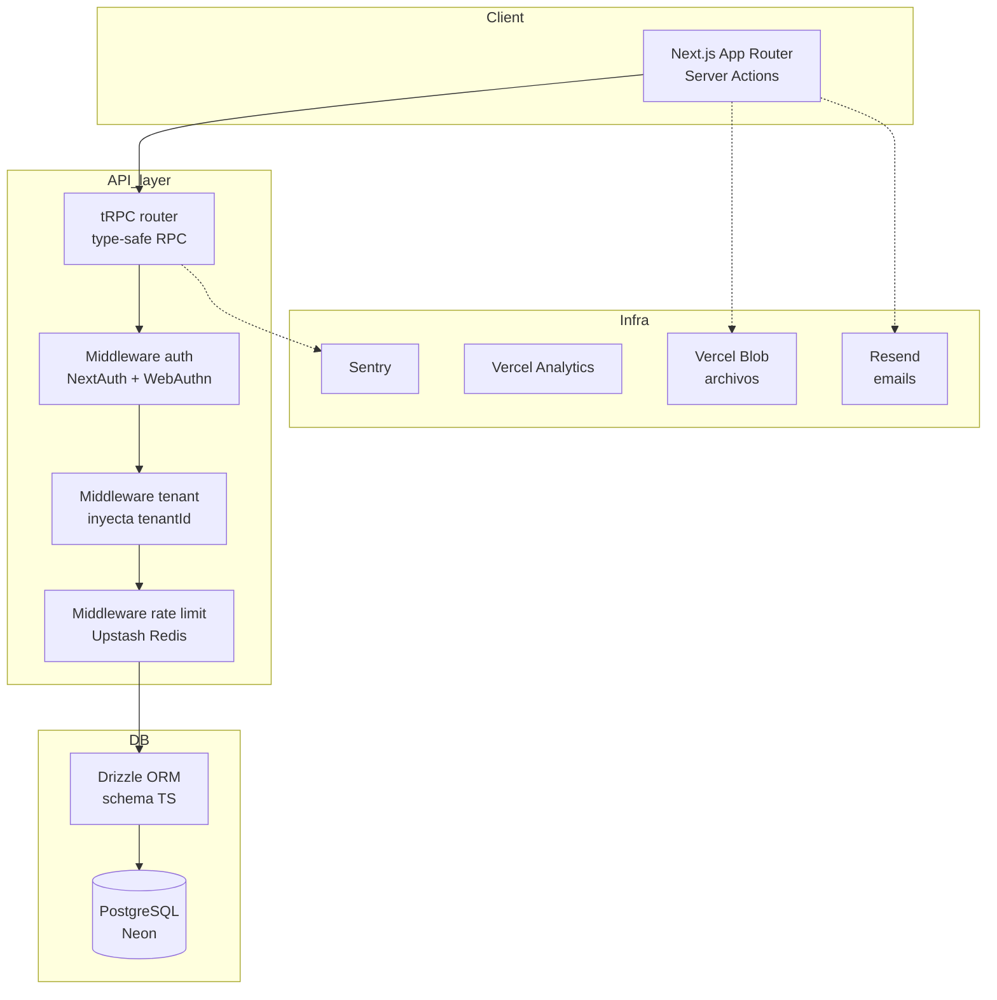

# SaaS multi-tenant type-safe end-to-end

> CRM para empresas de servicios en Espana. Reconstruccion completa en una v2
> con arquitectura type-safe end-to-end.

## Problema

Empresas de instalacion y mantenimiento (agua, climatizacion, fotovoltaica,
alarmas, fontaneria) necesitan un CRM que soporte muchas empresas en la misma
plataforma sin mezclar datos, con:

- Gestion de contratos, citas, catalogo de productos
- Portal de cliente para cada tenant
- Firma electronica y PDFs generados
- Autenticacion moderna (passkeys)
- Dashboards con graficos
- Rate limiting por tenant

Restricciones:

- Aislamiento estricto de datos por tenant
- Cambios en backend deben romper el frontend en compile-time (no en runtime)
- Tests E2E que prueben aislamiento explicitamente
- Deploy en un proveedor cloud-native

## Arquitectura

## Decisiones clave

### tRPC end-to-end type-safe

**Beneficio**: cambiar la firma de un procedure en el backend rompe el cliente en
compile-time. El TypeScript compiler es el linter.

**Costo**: acoplamiento cliente-servidor. No sirve para APIs publicas o mobile
con SDK propio. Para SaaS internal donde el frontend y el backend estan en el
mismo repo, es ideal.

### Drizzle ORM sobre Prisma

Drizzle es mas cercano al SQL (mejor para queries complejas del CRM), tiene mejor
performance en cold start, y sus types se propagan mas limpiamente al query builder.

### Aislamiento multi-tenant desde el dia 1

Cada tabla tiene `tenantId` como columna obligatoria. Middleware inyecta el
`tenantId` desde la sesion en cada query. Tests specific que:

- Un usuario del tenant A no ve datos del tenant B
- Un admin del tenant A no puede escribir a tabla del tenant B via ID directo
- Cambios de tenant emiten evento de auditoria

### WebAuthn / passkeys en lugar de password

`@simplewebauthn/browser` + `@simplewebauthn/server` integrados con NextAuth.
Los tenants B2B agradecen no manejar recuperacion de password.

### Rate limiting por tenant

`@upstash/ratelimit` con clave `${tenantId}:${route}`. Un tenant abusivo no
afecta a los demas. Configuracion por plan (free/pro/enterprise).

### Tests

- **Vitest** para unit (~200 tests)
- **Playwright** para E2E (~30 flows criticos: login, alta cliente, contrato, cita, factura)
- **Testing Library** para componentes UI aislados

### Generacion de PDF con `@react-pdf/renderer`

Componentes React que renderean a PDF. Reutilizamos el design system del UI web.
Alternativa a Puppeteer: mas rapido, sin browser en runtime.

## Anti-patterns evitados

- ❌ **Schema-per-tenant en PostgreSQL**: se rompe rapido a escala (migraciones N veces)
- ❌ **Row-level security como unica capa**: buena defense-in-depth pero fragil como unica linea
- ❌ **REST + fetch sin tipos generados**: contrato de facto que se rompe silenciosamente
- ❌ **Passwords sin passkeys en 2026**: los tenants B2B lo notan

## Stack

- Next.js (App Router + Server Actions)
- tRPC + React Query
- Drizzle ORM + PostgreSQL (Neon serverless)
- NextAuth + `@simplewebauthn/*`
- Upstash Redis (rate limit)
- Vercel Blob (archivos)
- `@react-pdf/renderer` (PDFs)
- Resend (emails)
- Sentry + Vercel Analytics
- Vitest + Playwright + Testing Library
- Tailwind + shadcn/ui + Radix

## Codigo de referencia sintetico

Ver [`multi-tenant-saas-starter`](https://github.com/jpfiguer/multi-tenant-saas-starter):

- Estructura de carpetas
- Middleware de tenant + auth
- Tests que prueban aislamiento
- Ejemplo de procedure tRPC con Drizzle

## Lecciones

- **El middleware que inyecta `tenantId` es la unica cosa que no se debe poder saltar**: escribir tests especificos para atacarlo
- **Rate limit por tenant desde el dia 1**: mas facil que sumar despues
- **Passkeys son un vendedor**: los tenants los notan positivamente
