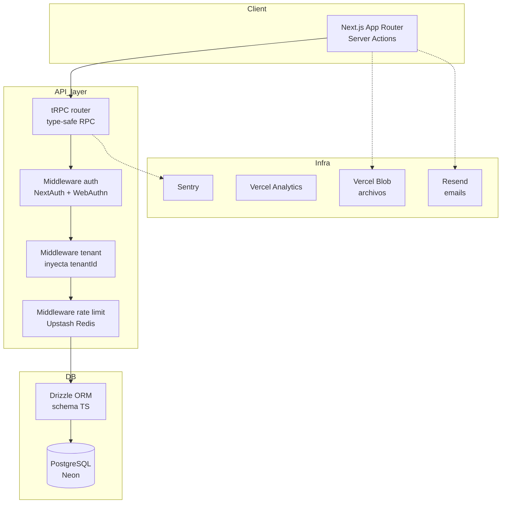

# SaaS multi-tenant type-safe de punta a punta

> CRM para empresas de servicios en España. La v2 es una reconstrucción
> completa, con tipos compartidos de punta a punta entre backend y frontend.

## Requisitos

Empresas de instalación y mantenimiento (agua, climatización, fotovoltaica,
alarmas, fontanería) necesitan un CRM en el que muchas empresas compartan la
plataforma sin mezclar sus datos, con:

- Gestión de contratos, citas y catálogo de productos
- Portal de cliente para cada tenant
- Firma electrónica y generación de PDF
- Autenticación con passkeys
- Dashboards con gráficos
- Rate limiting por tenant

Restricciones:

- Aislamiento estricto de datos entre tenants
- Los cambios incompatibles del backend tienen que detectarse al compilar el
  frontend
- Tests E2E que prueben el aislamiento de forma explícita
- Despliegue en un proveedor cloud-native

## Arquitectura

```mermaid
flowchart TB
  subgraph Client
    A[Next.js App Router<br/>Server Actions]
  end

  subgraph API_layer
    B[tRPC router<br/>type-safe RPC]
    C[Middleware tenant<br/>inyecta tenantId]
    D[Middleware auth<br/>NextAuth + WebAuthn]
    E[Middleware rate limit<br/>Upstash Redis]
  end

  subgraph DB
    F[(PostgreSQL<br/>Neon)]
    G[Drizzle ORM<br/>schema TS]
  end

  subgraph Infra
    H[Vercel Blob<br/>archivos]
    I[Vercel Analytics]
    J[Sentry]
    K[Resend<br/>emails]
  end

  A --> B
  B --> D
  D --> C
  C --> E
  E --> G
  G --> F

  A -.-> H
  A -.-> K
  B -.-> J
```

## Decisiones

### tRPC con tipos de punta a punta

**Beneficio**: si cambia la firma de un procedure en el backend, el cliente
deja de compilar. El compilador de TypeScript hace de linter del contrato.

**Costo**: acopla cliente y servidor, así que no sirve para APIs públicas ni
para apps móviles con SDK propio. En un SaaS con frontend y backend en el mismo
repositorio, como este, encaja bien.

### Drizzle ORM en vez de Prisma

Drizzle está más cerca del SQL, lo que ayuda con las consultas complejas del
CRM. Además tiene mejor rendimiento en cold start y sus tipos se propagan con
más limpieza al query builder.

### Aislamiento multi-tenant desde el primer día

Cada tabla tiene `tenantId` como columna obligatoria, y un middleware lo inyecta
desde la sesión en cada consulta. Hay tests específicos que comprueban que:

- un usuario del tenant A no ve datos del tenant B;
- un admin del tenant A no puede escribir en tablas del tenant B con un ID
  directo;
- los cambios de tenant emiten un evento de auditoría.

### WebAuthn y passkeys en lugar de contraseñas

`@simplewebauthn/browser` y `@simplewebauthn/server`, integrados con NextAuth.
Los tenants B2B agradecen no tener que gestionar la recuperación de
contraseñas.

### Rate limiting por tenant

`@upstash/ratelimit` con la clave `${tenantId}:${route}`. Un tenant que abusa
no afecta a los demás, y los límites se configuran por plan (free, pro,
enterprise).

### Tests

- **Vitest** para tests unitarios
- **Playwright** para E2E de los flujos críticos: login, alta de cliente,
  contrato, cita y factura
- **Testing Library** para componentes de UI aislados

### PDF con `@react-pdf/renderer`

Los PDF se generan con componentes React que reutilizan el design system de la
interfaz web. Frente a Puppeteer es más rápido y no necesita un navegador en
runtime.

## Enfoques descartados

- **Un schema por tenant en PostgreSQL**: escala mal, porque cada migración se
  repite una vez por tenant.
- **Row-level security como única capa**: sirve como defensa en profundidad,
  pero es frágil como única barrera.
- **REST con fetch y sin tipos generados**: el contrato queda implícito y se
  rompe sin avisar.
- **Solo contraseñas, sin passkeys**: los tenants B2B lo notan.

## Stack

- Next.js (App Router y Server Actions)
- tRPC + React Query
- Drizzle ORM + PostgreSQL (Neon serverless)
- NextAuth + `@simplewebauthn/*`
- Upstash Redis (rate limiting)
- Vercel Blob (archivos)
- `@react-pdf/renderer` (PDF)
- Resend (correos)
- Sentry + Vercel Analytics
- Vitest + Playwright + Testing Library
- Tailwind + shadcn/ui + Radix

## Lo que aprendí

- **Nada debe poder saltarse el middleware que inyecta `tenantId`**: por eso
  tiene tests específicos que intentan atacarlo.
- **Rate limiting por tenant desde el primer día**: es más fácil que agregarlo
  después.
- **Las passkeys son un argumento de venta**: los tenants las valoran.
