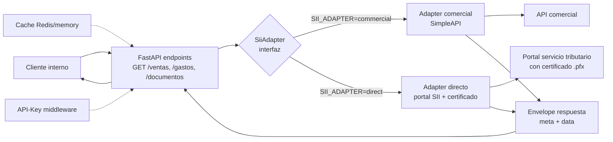

# Adapter pattern para integracion con el servicio tributario chileno

> API interna FastAPI para extraer el registro de compras y ventas del servicio
> tributario chileno. Adapter intercambiable entre proveedor comercial y
> conexion directa via variable de entorno, sin cambiar el contrato downstream.

## Problema

Necesitabamos integrar la API tributaria chilena — el registro de compras y
ventas — para varios flujos internos (facturacion, contabilidad, compliance).

Restricciones:

- La API oficial del servicio tributario solo expone scraping directo (portal
  con certificado)
- Los proveedores comerciales son rapidos al MVP pero tienen rate limits y
  costos que crecen con volumen
- Cambiar de un enfoque al otro no debe romper a los consumidores downstream

## Solucion: patron adapter

Una unica interfaz `SiiAdapter` con dos implementaciones intercambiables por
variable de entorno. El contrato publico `{ meta, data }` es invariante.

## Decisiones clave

### Contrato publico invariante

Envelope `{ meta, data }` con `meta.fuente` indicando el adapter activo. Los
consumidores no necesitan saber cual esta corriendo. Cambio = variable de
entorno.

### Pydantic v2 como fuente de verdad

`DocumentoTributario`, `Meta`, `Envelope` son modelos Pydantic que validan
tanto la salida de los adapters como la respuesta al cliente. Los adapters
normalizan su fuente al modelo canonico.

### Cache con abstraccion

`CACHE_BACKEND=memory|redis`. El adapter no sabe cual esta. `CachePort` con
implementaciones `MemoryCache` y `RedisCache`. Mismo trick que el adapter
principal — se cambia sin tocar el codigo de negocio.

### API key en todos los endpoints excepto `/health`

Header `X-API-Key`. Middleware simple. `/health` publico para orchestration
(k8s, ELB) que hace probes.

### Tests con `respx`

`respx` mockea httpx a nivel de request. Los tests corren offline, no tocan
el servicio tributario ni el proveedor comercial. Fixtures sinteticas
reproducen respuestas reales. **Nunca contiene datos reales.**

### Structured logging

`structlog` con contexto propagado (request_id, tenant_id opcional, adapter
activo). Cada log line es JSON. Ingesta a un stack de observabilidad.

### Deploy con Coolify

Coolify es un PaaS self-hosted. Docker + docker-compose para local, mismo
`Dockerfile` en produccion. Deploy via push a Git.

## Anti-patterns evitados

- ❌ **Acoplar el cliente al proveedor**: si el proveedor cambia formato, rompe todo
- ❌ **Cache "por si acaso"**: solo cacheo lo que tiene sentido con TTL claro
- ❌ **Tests que llaman al servicio real**: costoso, flaky, mata el CI

## Codigo de referencia sintetico

El patron esta reproducido en `rag-crag-reference` (circuit breaker + adapter
para rerankers) y como codigo standalone en el repo umbrella.

## Lecciones

- **Un adapter permite migrar sin dolor**: MVP con comercial, control con directo, sin romper consumidores
- **Fixtures sinteticas > mocks reales**: son mas rapidas, mas legibles y no dependen de credenciales
- **structlog te salva** cuando el bug es multi-adapter y hay que trazar cual fue
