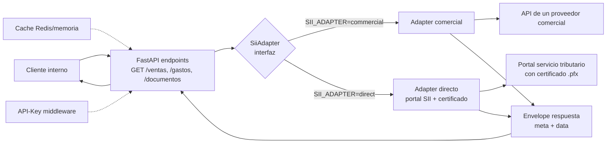

# Patrón adapter para integrarse con el servicio tributario chileno

> API interna en FastAPI para extraer el registro de compras y ventas del
> servicio tributario chileno. Un adapter permite cambiar entre un proveedor
> comercial y la conexión directa con una variable de entorno, sin tocar el
> contrato con los consumidores.

## Contexto

Necesitábamos el registro de compras y ventas del servicio tributario para
varios flujos internos: facturación, contabilidad y cumplimiento normativo.

Restricciones:

- El servicio tributario no ofrece una API pública documentada para este
  registro. La vía directa es su portal web, autenticado con certificado
  digital.
- Los proveedores comerciales permiten llegar rápido a un MVP, pero tienen
  rate limits y costos que crecen con el volumen.
- Pasar de un enfoque al otro no puede romper a los consumidores downstream.

## Solución: patrón adapter

Una sola interfaz, `SiiAdapter`, con dos implementaciones que se eligen por
variable de entorno. El contrato público `{ meta, data }` no cambia.

```mermaid
flowchart LR
  A[Cliente interno] --> B[FastAPI endpoints<br/>GET /ventas, /gastos, /documentos]
  B --> C{SiiAdapter<br/>interfaz}
  C -->|SII_ADAPTER=commercial| D[Adapter comercial]
  C -->|SII_ADAPTER=direct| E[Adapter directo<br/>portal SII + certificado]
  D --> F[API de un proveedor comercial]
  E --> G[Portal servicio tributario<br/>con certificado .pfx]
  D & E --> H[Envelope respuesta<br/>meta + data]
  H --> B
  B --> A

  I[Cache Redis/memoria] -.-> B
  J[API-Key middleware] -.-> B
```

## Detalles de implementación

### Un contrato público estable

El envelope `{ meta, data }` indica en `meta.fuente` qué adapter está activo,
aunque los consumidores no necesitan saberlo. Cambiar de adapter es cambiar una
variable de entorno.

### Pydantic v2 como fuente de verdad

`DocumentoTributario`, `Meta` y `Envelope` son modelos Pydantic que validan
tanto la salida de los adapters como la respuesta al cliente. Cada adapter
normaliza su fuente al modelo canónico.

### Caché detrás de una interfaz

`CACHE_BACKEND=memory|redis` elige la implementación de `CachePort`:
`MemoryCache` o `RedisCache`. El adapter no sabe cuál está activa. Es la misma
idea del adapter principal: se cambia sin tocar el código de negocio.

### API key en todos los endpoints salvo `/health`

Header `X-API-Key`, validado por un middleware simple. `/health` queda público
para los probes de orquestadores y balanceadores (k8s, ELB).

### Tests con `respx`

`respx` simula httpx a nivel de request, así que los tests corren offline, sin
tocar el servicio tributario ni el proveedor comercial. Las fixtures son
sintéticas: reproducen la forma de las respuestas reales y nunca contienen
datos reales.

### Logs estructurados

`structlog` con contexto propagado (`request_id`, `tenant_id` opcional y
adapter activo). Cada línea de log es JSON y se envía a un stack de
observabilidad.

### Despliegue con Coolify

Coolify es un PaaS autoalojado. En local se usa Docker con docker-compose, y en
producción, el mismo `Dockerfile`. Cada push a Git gatilla un despliegue.

## Prácticas descartadas

- **Acoplar el cliente al proveedor**: si el proveedor cambia el formato, se
  rompen todos los consumidores.
- **Cachear "por si acaso"**: solo se cachea lo que tiene sentido, con un TTL
  claro.
- **Tests que llaman al servicio real**: son caros e inestables, y vuelven
  frágil el CI.

## Lo que me llevo

- **Un adapter permite migrar sin dolor**: el proveedor comercial sirve para el
  MVP y la conexión directa da más control, sin romper a los consumidores.
- **Mejor fixtures sintéticas que mocks con datos reales**: son más rápidas,
  más legibles y no dependen de credenciales.
- **Los logs estructurados ahorran tiempo** cuando un bug cruza varios adapters
  y hay que rastrear cuál falló.
